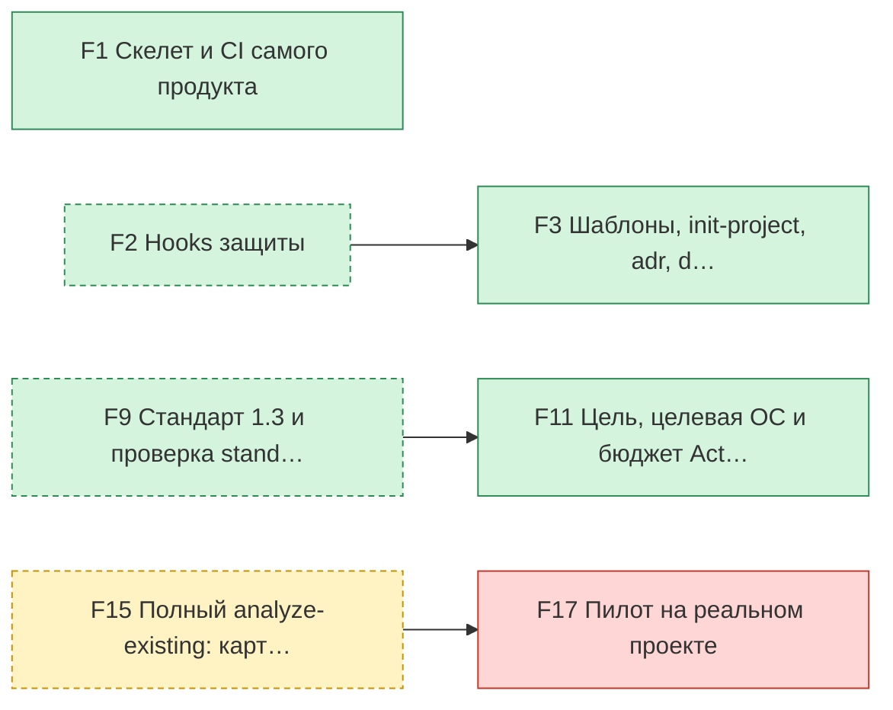
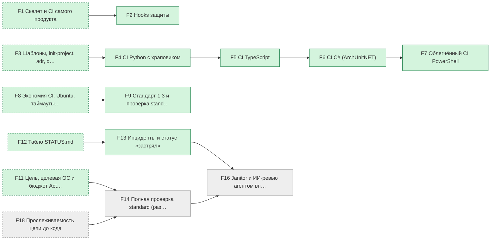
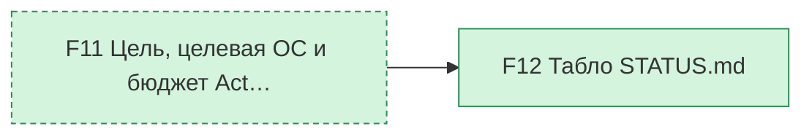
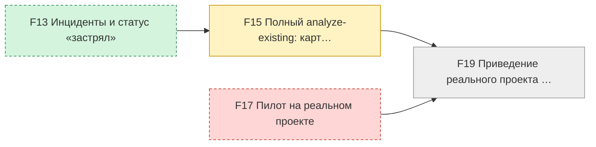
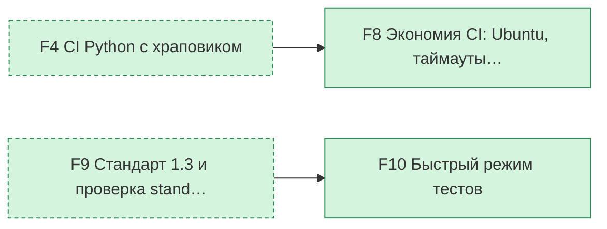
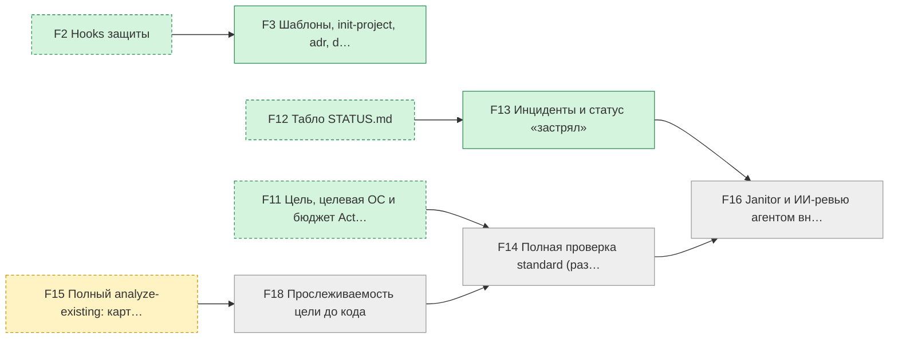

# Прогресс: 13 из 19 блоков готово · G1 — 3 из 4 · G2 — 7 из 9 · критерий G3 выполнен · G4 — 0 из 2 · критерий G5 выполнен · G6 — 2 из 5
Обновлено: 2026-10-04, коммит `005c3dc` · данные: `state/features.json`, `docs/GOAL.md`, отчёт CI, `state/incidents/`

## Нужно ваше решение
- **F17 «Пилот на реальном проекте»** ждёт владельца, приёмка в `state/acceptance/F17.md`

## В работе
- F15 «Полный analyze-existing: карта модулей и швов, восстановленные решения, черновик цели, план приведения к стандарту» — идёт работа

## План
| Критерий | Блок | Что это | Статус | Зависит от | Инциденты |
|---|---|---|---|---|---|
| G1 Проект на любом из четырёх языков подключает… | F1 | Скелет и CI самого продукта | ✅ готово | — | 0 |
| G1 Проект на любом из четырёх языков подключает…, G6 ИИ не теряет нить проекта: петли обнаруживаю… | F3 | Шаблоны, init-project, adr, doctor | ✅ готово | F2 | 0 |
| G1 Проект на любом из четырёх языков подключает… | F11 | Цель, целевая ОС и бюджет Actions в init | ✅ готово | F9 | 0 |
| G1 Проект на любом из четырёх языков подключает… | F17 | Пилот на реальном проекте | 🙋 ждёт владельца | F15 | 0 |
| G2 ИИ не может «заглушить» проверки: удалённые … | F2 | Hooks защиты | ✅ готово | F1 | 0 |
| G2 ИИ не может «заглушить» проверки: удалённые … | F4 | CI Python с храповиком | ✅ готово | F3 | 0 |
| G2 ИИ не может «заглушить» проверки: удалённые … | F5 | CI TypeScript | ✅ готово | F4 | 0 |
| G2 ИИ не может «заглушить» проверки: удалённые … | F6 | CI C# (ArchUnitNET) | ✅ готово | F5 | 0 |
| G2 ИИ не может «заглушить» проверки: удалённые … | F7 | Облегчённый CI PowerShell | ✅ готово | F6 | 0 |
| G2 ИИ не может «заглушить» проверки: удалённые … | F9 | Стандарт 1.3 и проверка standard | ✅ готово | F8 | 0 |
| G2 ИИ не может «заглушить» проверки: удалённые …, G6 ИИ не теряет нить проекта: петли обнаруживаю… | F13 | Инциденты и статус «застрял» | ✅ готово | F12 | 0 |
| G2 ИИ не может «заглушить» проверки: удалённые …, G6 ИИ не теряет нить проекта: петли обнаруживаю… | F14 | Полная проверка standard (раздел 11) | ⏳ впереди | F11, F18 | 0 |
| G2 ИИ не может «заглушить» проверки: удалённые …, G6 ИИ не теряет нить проекта: петли обнаруживаю… | F16 | Janitor и ИИ-ревью агентом внутри Claude Code (без платного API в CI) | ⏳ впереди | F13, F14 | 0 |
| G3 Владелец видит состояние проекта на одной ст… | F12 | Табло STATUS.md | ✅ готово | F11 | 0 |
| G4 Существующий проект можно проверить и привес… | F15 | Полный analyze-existing: карта модулей и швов, восстановленные решения, черновик цели, план приведения к стандарту | 🔨 в работе | F13 | 0 |
| G4 Существующий проект можно проверить и привес… | F19 | Приведение реального проекта к стандарту по утверждённому плану | ⏳ впереди | F15, F17 | 0 |
| G5 CI не тратит квоту впустую | F8 | Экономия CI: Ubuntu, таймауты, отмена | ✅ готово | F4 | 0 |
| G5 CI не тратит квоту впустую | F10 | Быстрый режим тестов | ✅ готово | F9 | 0 |
| G6 ИИ не теряет нить проекта: петли обнаруживаю… | F18 | Прослеживаемость цели до кода | ⏳ впереди | F15 | 0 |

## Зависимости блоков
По одной небольшой диаграмме на критерий готовности. Пунктирные блоки относятся к другому критерию и показаны только как «от чего зависит».

### G1 Проект на любом из четырёх языков подключается одной командой, и результат проверен на живом проекте: 3 из 4 блоков готово

### G2 ИИ не может «заглушить» проверки: удалённые и пропущенные тесты, дубли, мёртвый код и нарушения границ ловятся на всех четырёх языках: 7 из 9 блоков готово

### G3 Владелец видит состояние проекта на одной странице и не читает код: 1 из 1 блоков готово

### G4 Существующий проект можно проверить и привести к стандарту: 0 из 2 блоков готово

### G5 CI не тратит квоту впустую: 2 из 2 блоков готово

### G6 ИИ не теряет нить проекта: петли обнаруживаются, решения и уроки не забываются, цель прослеживается до кода: 2 из 5 блоков готово

## Тесты
- Всего **1512** (было 1506).
- Упавших: **0**. Пропущенных: **9**.
- Источник: отчёт прогона CI на коммите `ee8d51d` (то же содержимое, что у табло).

## Расход CI
- За 7 дней: **3995** минут квоты в 127 прогонах (Windows считается x2). Впустую, то есть упало или отменено: **996** минут в 17 прогонах.
- На один PR: в среднем **89** минут (PR за неделю: 34); больше всего у PR #9: 690 минут.

| PR | Прогонов | Минут | Из них впустую |
|---|---|---|---|
| #34 | 2 | 14 | 0 |
| #33 | 2 | 13 | 0 |
| #32 | 2 | 13 | 0 |
| #31 | 4 | 24 | 0 |
| #30 | 2 | 10 | 0 |
| #29 | 4 | 27 | 0 |
| #28 | 3 | 39 | 1 |
| #27 | 2 | 17 | 0 |

- Вне PR (после слияния, табло): 983 минут.
Минуты и деньги смотрите на GitHub: [использование Actions](https://github.com/settings/billing/summary), [бюджеты](https://github.com/settings/billing/budgets).

## Соответствие стандарту
Карточка пунктов P1–P13 появится вместе с полной проверкой `standard`.
