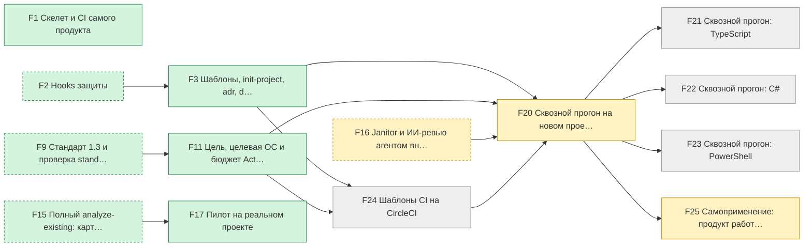
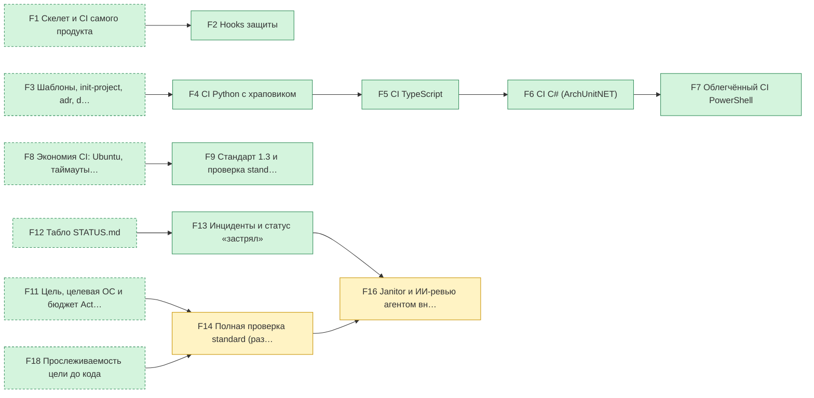
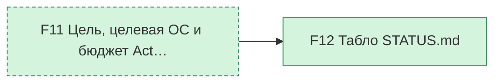
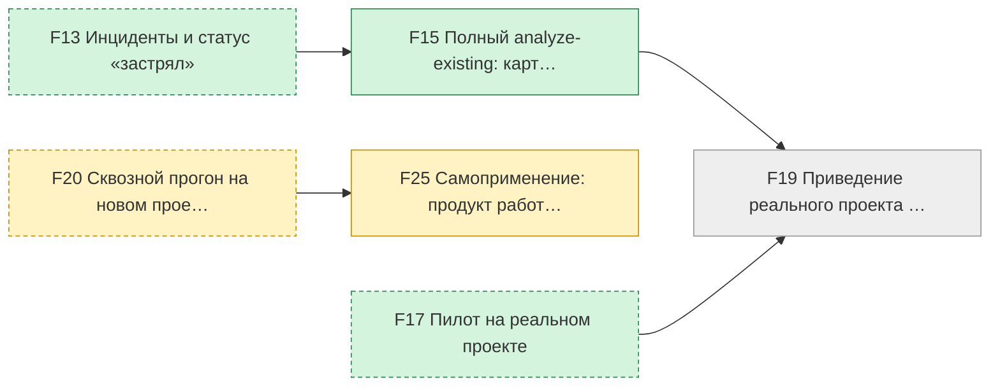
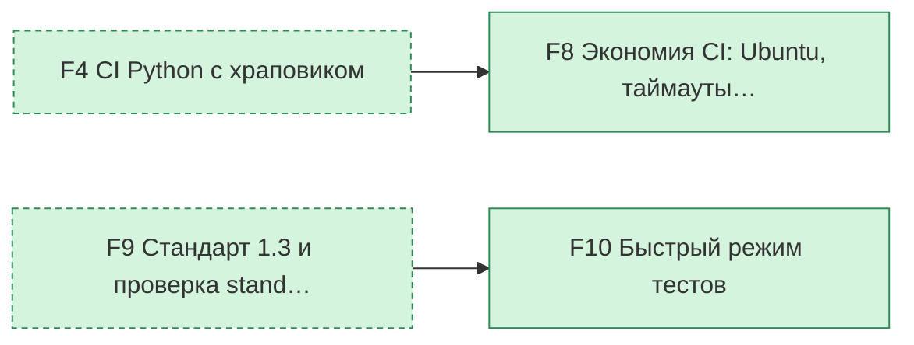
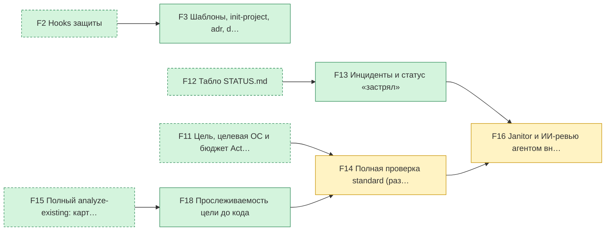

# Прогресс: 16 из 25 блоков готово · G1 — 4 из 10 · G2 — 7 из 9 · критерий G3 выполнен · G4 — 1 из 3 · критерий G5 выполнен · G6 — 3 из 5
Обновлено: 2026-10-10, коммит `da9eca6` · данные: `state/features.json`, `docs/GOAL.md`, отчёт CI, `state/incidents/`

## Нужно ваше решение
- ничего: всё идёт без вашего участия

## В работе
- F14 «Полная проверка standard (раздел 11)» — идёт работа
- F16 «Janitor и ИИ-ревью агентом внутри Claude Code (без платного API в CI)» — идёт работа
- F20 «Сквозной прогон на новом проекте» — идёт работа
- F25 «Самоприменение: продукт работает под своими же правилами» — идёт работа

## План
| Критерий | Блок | Что это | Статус | Зависит от | Инциденты |
|---|---|---|---|---|---|
| G1 Проект на любом из четырёх языков подключает… | F1 | Скелет и CI самого продукта | ✅ готово | — | 0 |
| G1 Проект на любом из четырёх языков подключает…, G6 ИИ не теряет нить проекта: петли обнаруживаю… | F3 | Шаблоны, init-project, adr, doctor | ✅ готово | F2 | 0 |
| G1 Проект на любом из четырёх языков подключает… | F11 | Цель, целевая ОС и бюджет Actions в init | ✅ готово | F9 | 0 |
| G1 Проект на любом из четырёх языков подключает… | F17 | Пилот на реальном проекте | ✅ готово | F15 | 0 |
| G1 Проект на любом из четырёх языков подключает… | F20 | Сквозной прогон на новом проекте | 🔨 в работе | F3, F11, F16, F24 | 0 |
| G1 Проект на любом из четырёх языков подключает… | F21 | Сквозной прогон: TypeScript | ⏳ впереди | F20 | 0 |
| G1 Проект на любом из четырёх языков подключает… | F22 | Сквозной прогон: C# | ⏳ впереди | F20 | 0 |
| G1 Проект на любом из четырёх языков подключает… | F23 | Сквозной прогон: PowerShell | ⏳ впереди | F20 | 0 |
| G1 Проект на любом из четырёх языков подключает… | F24 | Шаблоны CI на CircleCI | ⏳ впереди | F3, F11 | 0 |
| G2 ИИ не может «заглушить» проверки: удалённые … | F2 | Hooks защиты | ✅ готово | F1 | 0 |
| G2 ИИ не может «заглушить» проверки: удалённые … | F4 | CI Python с храповиком | ✅ готово | F3 | 0 |
| G2 ИИ не может «заглушить» проверки: удалённые … | F5 | CI TypeScript | ✅ готово | F4 | 0 |
| G2 ИИ не может «заглушить» проверки: удалённые … | F6 | CI C# (ArchUnitNET) | ✅ готово | F5 | 0 |
| G2 ИИ не может «заглушить» проверки: удалённые … | F7 | Облегчённый CI PowerShell | ✅ готово | F6 | 0 |
| G2 ИИ не может «заглушить» проверки: удалённые … | F9 | Стандарт 1.3 и проверка standard | ✅ готово | F8 | 0 |
| G2 ИИ не может «заглушить» проверки: удалённые …, G6 ИИ не теряет нить проекта: петли обнаруживаю… | F13 | Инциденты и статус «застрял» | ✅ готово | F12 | 0 |
| G2 ИИ не может «заглушить» проверки: удалённые …, G6 ИИ не теряет нить проекта: петли обнаруживаю… | F14 | Полная проверка standard (раздел 11) | 🔨 в работе | F11, F18 | 0 |
| G2 ИИ не может «заглушить» проверки: удалённые …, G6 ИИ не теряет нить проекта: петли обнаруживаю… | F16 | Janitor и ИИ-ревью агентом внутри Claude Code (без платного API в CI) | 🔨 в работе | F13, F14 | 0 |
| G3 Владелец видит состояние проекта на одной ст… | F12 | Табло STATUS.md | ✅ готово | F11 | 0 |
| G4 Существующий проект можно проверить и привес… | F15 | Полный analyze-existing: карта модулей и швов, восстановленные решения, черновик цели, план приведения к стандарту | ✅ готово | F13 | 0 |
| G4 Существующий проект можно проверить и привес… | F19 | Приведение реального проекта к стандарту по утверждённому плану | ⏳ впереди | F15, F17 | 0 |
| G4 Существующий проект можно проверить и привес…, G1 Проект на любом из четырёх языков подключает… | F25 | Самоприменение: продукт работает под своими же правилами | 🔨 в работе | F20 | 0 |
| G5 CI не тратит квоту впустую | F8 | Экономия CI: Ubuntu, таймауты, отмена | ✅ готово | F4 | 0 |
| G5 CI не тратит квоту впустую | F10 | Быстрый режим тестов | ✅ готово | F9 | 0 |
| G6 ИИ не теряет нить проекта: петли обнаруживаю… | F18 | Прослеживаемость цели до кода | ✅ готово | F15 | 0 |

## Прослеживаемость
- Блоков без модулей в `docs/MODULES.md`: 5: F11, F16, F17, F20, F25

## Зависимости блоков
По одной небольшой диаграмме на критерий готовности. Пунктирные блоки относятся к другому критерию и показаны только как «от чего зависит».

### G1 Проект на любом из четырёх языков подключается одной командой, и результат проверен на живом проекте: 4 из 10 блоков готово

### G2 ИИ не может «заглушить» проверки: удалённые и пропущенные тесты, дубли, мёртвый код и нарушения границ ловятся на всех четырёх языках: 7 из 9 блоков готово

### G3 Владелец видит состояние проекта на одной странице и не читает код: 1 из 1 блоков готово

### G4 Существующий проект можно проверить и привести к стандарту: 1 из 3 блоков готово

### G5 CI не тратит квоту впустую: 2 из 2 блоков готово

### G6 ИИ не теряет нить проекта: петли обнаруживаются, решения и уроки не забываются, цель прослеживается до кода: 3 из 5 блоков готово

## Тесты
- Всего **2197** (было 2177).
- Упавших: **1**. Пропущенных: **9**.
  - упал: tests.test_circleci_templates::test_the_official_validator_rejects_a_broken_config
- Источник: отчёт прогона CI на коммите `da9eca6` (то же содержимое, что у табло).

## Расход CI
Минуты и деньги смотрите на GitHub: [использование Actions](https://github.com/settings/billing/summary), [бюджеты](https://github.com/settings/billing/budgets).

## Соответствие стандарту
По стандарту **9** из 13 пунктов. Оценка по файлам репозитория и правилам проверки `standard`; «вопрос владельцу» — из репозитория не видно, ответ знаете вы.

| Пункт | Что проверяется | Оценка | Динамика | Почему |
|---|---|---|---|---|
| P1 | Цель продукта записана и имеет проверяемые критерии | 🟢 по стандарту | впервые | критериев готовности: 6, утверждена владельцем: да |
| P2 | Прослеживаемость цель, блоки, тесты, модули | 🟢 по стандарту | впервые | реестр блоков: да, карта модулей: да, нарушений связности: 0 |
| P3 | Инструкции для ИИ: одно место, короткие, без противоречий | 🟢 по стандарту | впервые | строк в AGENTS.md: 150 (бюджет 150), лишних файлов инструкций: 0 |
| P4 | Инструкции Claude Project версионируются | 🔴 отсутствует | впервые | нет docs/PROJECT_INSTRUCTIONS.md: инструкции Claude Project есть только в настройках |
| P5 | Расползание планов и заметок | 🟡 частично | впервые | .md вне разрешённых мест: 17 |
| P6 | Решения записаны | 🟢 по стандарту | впервые | записей решений (ADR): 22 |
| P7 | Защита от ложного «готово» | 🟢 по стандарту | впервые | CI: да, проверка standard в CI: да, правила permissions для агентов: да; защиту ветки по файлам не видно |
| P8 | Источник истины один | ❓ вопрос владельцу | впервые | состояние в state/features.json; есть ли трекеры, чаты или файлы на диске вне репозитория, знаете вы |
| P9 | Протокол перед решением | 🟢 по стандарту | впервые | в правилах есть протокол с разделом «Основания», CI проверяет, что он заполнен |
| P10 | Обработка сбоев | 🟢 по стандарту | впервые | шаблон отчёта: да, бюджет инцидентов в CONSTITUTION.md: да, нарушений в отчётах и статусах блоков: 0 |
| P11 | Повторение ошибок | 🟢 по стандарту | впервые | есть docs/LESSONS.md, уроки ссылаются на тесты: да |
| P12 | Взаимодействие человек, Project, исполнитель | ❓ вопрос владельцу | впервые | кто что решает и через что передаёт, из репозитория не видно: есть ли решения только в чатах, знаете вы |
| P13 | Стоимость CI | 🟢 по стандарту | впервые | конфигов CI: 2, нарушений стоимости (таймауты, отмена, триггеры, раннеры): 0, целевая ОС в CONSTITUTION.md: да |

Стандарт проекта: ProjectArchitect 1.3, действующая версия 1.3.
